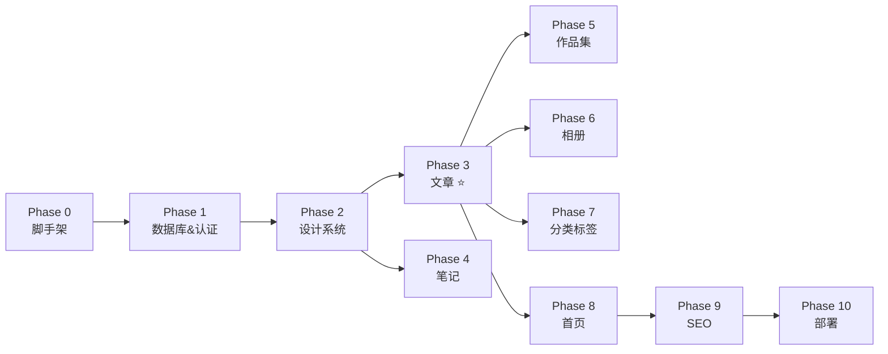

# 个人博客系统开发文档

> 版本：v1.1
> 最后更新：2026-07-18（待启动 Phase 0；稳定技术栈与视觉 Token 已统一）
> 配套文档：[REQUIREMENTS.md](./REQUIREMENTS.md) · [docs/technology-baseline.md](./docs/technology-baseline.md)（技术版本唯一事实来源）

> **配套设计文档**：[docs/design-decisions.md](./docs/design-decisions.md)（设计 Token）· [docs/visual-anchor.png](./docs/visual-anchor.png)（视觉锚）

---

## 目录

1. [开发理念与原则](#1-开发理念与原则)
2. [总体策略](#2-总体策略)
3. [阶段总览](#3-阶段总览)
4. [依赖关系图](#4-依赖关系图)
5. [详细阶段规划](#5-详细阶段规划)
6. [任务依赖矩阵](#6-任务依赖矩阵)
7. [验收与测试](#7-验收与测试)
8. [风险与应对](#8-风险与应对)
9. [常用命令速查](#9-常用命令速查)
10. [里程碑总表](#10-里程碑总表)

---

## 1. 开发理念与原则

### 1.1 核心原则

1. **地基先行**：脚手架、数据库、认证先于业务功能
2. **可演示优先**：每个阶段结束都有"能截图发朋友圈"的成果
3. **复用前置**：共用组件（编辑器、上传、Markdown 渲染）第一天就抽象出来
4. **可见性优先**：私密逻辑从 Day 1 就统一封装
5. **小步快跑**：每个阶段不超过 5 天，每个任务 1-4 小时
6. **可回滚**：每个阶段结束打 Git Tag，方便回退
7. **后台 → 前台**：同一个模块里，先后台 CRUD 跑通，再前台展示

### 1.2 排序决策表

| 顺序                             | 决策             | 理由                                       |
| -------------------------------- | ---------------- | ------------------------------------------ |
| 脚手架 → 认证 → 设计系统 → 内容  | 而非内容先行     | 内容和认证耦合（私密权限），认证需要脚手架 |
| 文章 → 笔记 → 作品 → 相册        | 而非按字母或时间 | 文章功能最全，是其他模块的"母版"           |
| 后台 CRUD → 前台展示             | 同步推进         | 同一个模块内先跑通后台，再做前台           |
| 公开功能 → 私密功能              | 先公开后私密     | 公开无权限复杂度，先打通主流程             |
| 本地 SQLite → 部署 PostgreSQL 17 | 分阶段切换       | 本地零配置，部署时再换高性能方案           |

### 1.3 拒绝的做法

- ❌ 一上来就堆功能、不管测试
- ❌ 多个模块并行开发（容易上下文切换丢东西）
- ❌ 凭感觉决定下一步做什么
- ❌ 跳过验收直接进入下一阶段
- ❌ 不打 Tag 出问题无法回退

---

## 2. 总体策略

### 2.1 节奏控制

| 维度       | 数值                                 |
| ---------- | ------------------------------------ |
| 每阶段     | 3-5 天                               |
| 每任务     | 1-4 小时                             |
| 每天结束   | 提交代码到 Git                       |
| 每阶段结束 | 阶段验收 + Git Tag + 更新 ROADMAP.md |
| 每天开工   | 拉最新代码 + 看 ROADMAP.md 当日任务  |

### 2.2 提交规范（Conventional Commits）

```
feat:     新功能
fix:      修复 bug
chore:    杂项（依赖、配置）
docs:     文档
style:    格式调整
refactor: 重构
test:     测试
perf:     性能优化
```

**示例**：

```bash
git commit -m "feat(articles): 添加文章列表分页"
git commit -m "fix(upload): 修复大文件上传失败"
```

### 2.3 分支策略（简化版）

```
main                 ← 主分支，始终可运行
└── feat/xxx         ← 功能分支（可选，个人项目不一定需要）
```

**个人项目推荐**：直接在 main 上开发，每完成一个阶段打 Tag。

### 2.4 技术版本与分阶段安装

完整版本矩阵统一维护在 [docs/technology-baseline.md](./docs/technology-baseline.md)，本开发文档不得另行选择不同主版本。

| 阶段      | 新增依赖范围                                                                    |
| --------- | ------------------------------------------------------------------------------- |
| Phase 0   | Next.js/React/TypeScript、Tailwind CSS、Prisma、shadcn/ui CLI、ESLint、Prettier |
| Phase 1   | NextAuth.js、bcryptjs、react-hook-form、Zod、Vitest（首次测试时）               |
| Phase 2   | lucide-react 和具体 shadcn/ui 组件依赖                                          |
| Phase 3   | next-mdx-remote、remark/rehype、rehype-pretty-code、Shiki                       |
| Phase 5–6 | sharp（若此前尚未安装）                                                         |
| 按需      | Husky、lint-staged，仅在启用 Git Hooks 时安装                                   |
| Phase 10  | PostgreSQL 17 或兼容该版本的托管服务                                            |

**锁定规则**：不得使用 `latest` 或预发布标签；React/React DOM、Prisma CLI/Client 必须严格同版，Next.js/`eslint-config-next` 必须保持同一版本线，最终解析结果提交到 `pnpm-lock.yaml`。

---

## 3. 阶段总览

| 阶段   | 名称            | 目标                   | 预计天数 | 累计 | Git Tag               |
| ------ | --------------- | ---------------------- | -------- | ---- | --------------------- |
| **0**  | 项目脚手架      | 能跑起来的空 Next.js   | 1        | 1    | `v0.1.0-foundation`   |
| **1**  | 数据库 & 认证   | 登录、用户管理可用     | 2        | 3    | `v0.2.0-auth`         |
| **2**  | 设计系统 & 布局 | 全站统一样式，页面有壳 | 2        | 5    | `v0.3.0-design`       |
| **3**  | 文章模块 ⭐     | 完整写、读、看流程     | 4        | 9    | `v0.4.0-articles`     |
| **4**  | 笔记模块        | 数字花园上线           | 2        | 11   | `v0.5.0-notes`        |
| **5**  | 作品集          | Behance 风格作品展示   | 3        | 14   | `v0.6.0-projects`     |
| **6**  | 相册            | 瀑布流照片墙           | 2        | 16   | `v0.7.0-photos`       |
| **7**  | 分类/标签/单页  | 辅助功能完善           | 2        | 18   | `v0.8.0-organization` |
| **8**  | 首页 & 归档     | 全站组装完成           | 2        | 20   | `v0.9.0-homepage`     |
| **9**  | SEO & 性能      | 上线准备               | 1        | 21   | `v1.0.0-rc1`          |
| **10** | 部署            | 真正可访问             | 2        | 23   | `v1.0.0`              |

**总计**：约 23 个工作日（≈ 1 个月专注开发）

---

## 4. 依赖关系图



---

## 5. 详细阶段规划

### Phase 0：项目脚手架

**目标**：能跑起来的空 Next.js 项目，配置好所有基础工具

**实际完成状态（2026-07-18）：**

- Phase 0 任务清单全部 13 项已勾；其中
  - 第 5 项「创建数据库 schema」按字面只完成 1/13（占位 `model User`），
    完整 13 张表（User/Article/Note/Project/ProjectImage/Album/Photo/Category/
    Tag/ArticleTag/NoteTag/ProjectTag/Page + Visibility/Status 枚举）推到 Phase 1 Day 1，
    理由见附录 B 2026-07-18 决策条目
  - 第 6 项「使用 shadcn/ui CLI 初始化 components.json」用
    [手工按 baseline 写入 + CLI 验证] 的等价路径完成：`pnpm dlx shadcn@3.8.5 init`
    检测到现有 config 后正常退出（`A components.json file already exists`），
    详见该任务下方的子条目与附录 B 决策条目
- 验收清单 8/8 已勾（命令 + 数据库 + 同版检查 + 项目结构 + Tag）
- Prisma 6.19.3 在 Windows 上的 schema-engine stderr 解析 bug 由 `scripts/db-prepare.cjs`
  绕过，详细见 [docs/prisma-known-issues.md](./docs/prisma-known-issues.md)
- 工时：实际 ~37 min（含 Prisma bug 排查约 20 min）；根目录 16 个项目自增文件、
  全部经 typecheck/lint/build 验证通过

**预计耗时**：1 天

**前置依赖**：无

**版本基线**：[docs/technology-baseline.md](./docs/technology-baseline.md)；Phase 0 不提前安装认证、Markdown、图片处理等后续依赖。

**任务清单**：

- [x] 确认 Node.js 24 LTS 与 pnpm 10 环境
- [x] 创建 Next.js 15.5 项目（App Router + React 19.1 + TypeScript 5.9）
- [x] 安装并配置 Tailwind CSS 3.4 + PostCSS 8 + Autoprefixer 10
- [x] 安装 Prisma 6.19 + `@prisma/client` 6.19，配置 SQLite
- [x] 创建数据库 schema（所有 11 张表）
- [x] 使用 shadcn/ui CLI 3 初始化 `components.json`
- [x] 配置 ESLint 9 + `eslint-config-next` 15.5 + Prettier 3
- [x] 创建项目目录结构（按 REQUIREMENTS 第 9 章）
- [x] 在 `package.json#packageManager`、`.nvmrc` 与 `pnpm-lock.yaml` 固定环境和依赖
- [x] 设置 `.env.example` 模板
- [x] 创建首页占位（Hello World）
- [x] 配置 `.gitignore`
- [x] 提交 Phase 0 脚手架

**关键文件**：

```text
package.json
pnpm-lock.yaml
.nvmrc
next.config.mjs
postcss.config.mjs
tailwind.config.ts
eslint.config.mjs
.prettierrc.json
components.json
tsconfig.json
prisma/schema.prisma
.env.example
.gitignore
src/app/layout.tsx
src/app/page.tsx
```

**验收标准**：

- [x] `node --version` 为 24.x LTS，`pnpm --version` 为 10.x
- [x] `pnpm install --frozen-lockfile` 能成功复现依赖
- [x] `pnpm dev` 能跑起来，访问 `http://localhost:3000` 看到占位页
- [x] `pnpm prisma validate` 与 `pnpm prisma db push` 均成功
- [x] React 与 React DOM、Prisma CLI 与 Client 均严格同版
- [x] Next.js 与 `eslint-config-next` 保持 15.5.x 版本线
- [x] 项目结构符合 REQUIREMENTS.md 第 9 章规划
- [x] Git 工作区干净并创建 `v0.1.0-foundation` Tag

**演示能力**：能跑起来的空网站

**Git Tag**：`v0.1.0-foundation`

---

### Phase 1：数据库 & 认证

**目标**：登录功能可用，后台能管理用户

**预计耗时**：2 天

**前置依赖**：Phase 0

**任务清单**：

**Day 1 - 认证核心**：

- [x] 安装 NextAuth.js 4.24、bcryptjs 3、react-hook-form 7、Zod 3.25
- [x] 配置 NextAuth.js v4（Credentials Provider）
- [x] 实现登录页 UI
- [x] 实现 JWT Session，由 HTTP-only Cookie 持有会话令牌
- [x] 密码使用 bcryptjs 加密（cost 12）
- [x] 登录限流（5 次/15 分钟）
- [x] 创建 seed 脚本（生成 admin 账号 + 测试朋友账号）

**Day 2 - 用户管理 + 权限中间件**：

- [ ] 实现可见性校验工具函数 `lib/visibility.ts`
- [ ] 实现 `middleware.ts`：保护 `/admin/*` 路由
- [ ] 实现 `middleware.ts`：过滤私密内容
- [ ] 后台用户管理（列表、新建、编辑、禁用）
- [ ] 重置密码功能
- [ ] 单元测试：可见性逻辑
- [ ] 单元测试：权限中间件

**关键文件**：

```
prisma/seed.ts
src/lib/auth.ts
src/lib/visibility.ts
src/lib/db.ts
src/middleware.ts
src/app/(frontend)/login/page.tsx
src/app/api/auth/[...nextauth]/route.ts
src/app/(admin)/admin/users/page.tsx
src/app/(admin)/admin/users/new/page.tsx
src/app/(admin)/admin/users/[id]/edit/page.tsx
```

**验收标准**：

- [ ] 访问 `/login` 输入 admin 账号能登录
- [ ] 未登录访问 `/admin/*` 跳转到 `/login`
- [ ] 登录后访问 `/admin` 能看到用户管理页
- [ ] 创建新用户，新用户能登录
- [ ] 密码在数据库中是 bcryptjs 哈希（明文看不到）
- [ ] 5 次错误密码后被限流 15 分钟
- [ ] 关闭浏览器再打开，session 保持（如果选了"记住我"）

**演示能力**：

- 登录/退出
- 创建/管理用户
- 朋友登录后能看到私密内容

**Git Tag**：`v0.2.0-auth`

---

### Phase 2：设计系统 & 布局

**目标**：全站统一视觉，前台和后台各有基本布局

> 📐 **参考视觉稿**：[docs/visual-anchor.png](./docs/visual-anchor.png)（全站标尺） · [docs/design-explorations/p1-style/01.png](./docs/design-explorations/p1-style/01.png)（基线风格）

**预计耗时**：2 天

**前置依赖**：Phase 1

**任务清单**：

**Day 1 - 主题 & 字体 & 公共组件**：

- [ ] 使用 Tailwind CSS 3.4 配置主题色（**主色 `#E85A2C`**，详见 [docs/design-decisions.md](./docs/design-decisions.md) —— 2026-07-18 由 #FF6B35 微调）
- [ ] 引入字体（思源黑体、思源宋体、Inter、JetBrains Mono）
- [ ] 使用 `next/font` 子集化 + 预加载
- [ ] 安装 lucide-react 0.577，并创建 `Button`、`Card`、`Input`、`Badge` 等 shadcn 基础组件
- [ ] 创建 `Header` 组件（含导航、搜索占位、登录状态）
- [ ] 创建 `Footer` 组件

**Day 2 - 布局 & 错误页**：

- [ ] 前台根布局（`Header + main + Footer`）
- [ ] 后台布局（`Sidebar + TopBar + Main`）
- [ ] `Sidebar` 组件（含所有后台导航项）
- [ ] 404 页面（友好提示 + 返回首页）
- [ ] 错误边界（Error Boundary）
- [ ] Loading 状态（Suspense + Skeleton）
- [ ] 移动端响应式（汉堡菜单、抽屉）

**关键文件**：

```
src/app/globals.css
tailwind.config.ts
src/components/ui/                      ← shadcn 组件
src/components/frontend/Header.tsx
src/components/frontend/Footer.tsx
src/components/admin/Sidebar.tsx
src/components/admin/AdminHeader.tsx
src/app/(frontend)/layout.tsx
src/app/(admin)/admin/layout.tsx
src/app/not-found.tsx
src/app/error.tsx
src/app/loading.tsx
```

**验收标准**：

- [ ] 全站文字、按钮、链接颜色符合设计系统
- [ ] 前台有 Header（含导航）和 Footer
- [ ] 后台有侧边栏和顶栏
- [ ] 移动端响应式正常
- [ ] 字体加载流畅，无 FOIT/FOUT
- [ ] Lighthouse 可访问性 > 90

**演示能力**：整个网站的"骨架"展示（点击导航都能正常切换）

**Git Tag**：`v0.3.0-design`

---

### Phase 3：文章模块（重点 ⭐）

**目标**：完整的文章写、读、看流程，包含可见性、代码高亮、Markdown 编辑

> 📐 **参考视觉稿**：[docs/visual-anchor.png](./docs/visual-anchor.png)（阅读体验标尺） · [docs/design-explorations/p3-articles/01.png](./docs/design-explorations/p3-articles/01.png)（文章列表） · [docs/design-explorations/p4-article-detail/04.png](./docs/design-explorations/p4-article-detail/04.png)（文章详情）

**预计耗时**：4 天（最重要的阶段）

**前置依赖**：Phase 2

**任务清单**：

**Day 1 - 后台 CRUD**：

- [ ] 文章列表页（表格 + 分页 + 状态筛选 + 搜索）
- [ ] 文章新建/编辑页表单
- [ ] Markdown 编辑器组件（左右分屏：编辑 + 实时预览）
- [ ] 工具栏：标题、加粗、斜体、链接、图片、代码块、引用、列表
- [ ] 可见性切换（PUBLIC/PRIVATE/PASSWORD）+ 密码输入
- [ ] 状态切换（DRAFT/PUBLISHED/ARCHIVED）
- [ ] 封面图上传（单图）
- [ ] 自动保存草稿（30 秒一次，存到 localStorage + 服务端）
- [ ] 分类选择（下拉）+ 标签输入（多选）
- [ ] slug 自动生成（基于标题拼音），可手动修改
- [ ] 软删除（移入回收站）

**Day 2 - Markdown 渲染 & 公共组件**：

- [ ] Markdown 渲染组件（含 GFM、代码高亮、表格、任务列表）
- [ ] 代码块复制按钮
- [ ] 图片懒加载
- [ ] 私密文章密码输入组件 `PasswordPrompt`
- [ ] 无权限时的占位组件 `NoAccess`
- [ ] 文章卡片组件 `ArticleCard`（封面 + 标题 + 摘要 + 元信息）
- [ ] 文章分类侧边栏组件 `CategorySidebar`
- [ ] 文章标签云组件 `TagCloud`
- [ ] 阅读时间计算工具

**Day 3 - 前台列表 + 详情**：

- [ ] `/articles` 列表页（杂志卡片网格，3 列 → 2 列 → 1 列）
- [ ] 分类筛选、标签筛选
- [ ] 分页或无限滚动（先做分页，简单）
- [ ] `/articles/[slug]` 详情页
  - 顶部全宽封面图（16:9）
  - 标题区（标题、发布时间、分类、阅读量）
  - 居中正文（最大宽度 720px，行高 1.8）
  - 文末：标签云、分享按钮
- [ ] SEO meta 标签（title、description、OG、Twitter Card）
- [ ] 阅读量统计（同一会话只计一次）
- [ ] 相关文章推荐（同分类 / 同标签，取 3 篇）

**Day 4 - 测试 & 完善**：

- [ ] Markdown XSS 防护测试
- [ ] 单元测试：`slug.ts`、`visibility.ts`
- [ ] E2E 测试（手动）：写一篇文章 → 发布 → 前台能看到
- [ ] 性能优化（图片懒加载、`next/image`）
- [ ] 移动端排版微调
- [ ] 写一份 README 给"未来的自己"用

**关键文件**：

```
src/components/admin/Editor/MarkdownEditor.tsx
src/components/admin/Editor/ImageUploader.tsx
src/components/admin/Editor/EditorToolbar.tsx
src/components/frontend/ArticleCard.tsx
src/components/frontend/MarkdownRenderer.tsx
src/components/frontend/PasswordPrompt.tsx
src/components/frontend/NoAccess.tsx
src/components/frontend/ShareButtons.tsx
src/components/frontend/RelatedArticles.tsx
src/lib/markdown.ts
src/lib/slug.ts
src/lib/reading-time.ts
src/server/articles.ts
src/app/(admin)/admin/articles/page.tsx
src/app/(admin)/admin/articles/new/page.tsx
src/app/(admin)/admin/articles/[id]/edit/page.tsx
src/app/(frontend)/articles/page.tsx
src/app/(frontend)/articles/[slug]/page.tsx
```

**验收标准**：

- [ ] 后台能创建、编辑、删除、置顶文章
- [ ] 代码块有语法高亮 + 一键复制按钮
- [ ] 公开文章前台能看到，私密文章游客看不到
- [ ] 密码文章输入正确密码后才能看（错误密码有提示）
- [ ] 草稿、已发布、已归档状态正确显示
- [ ] 移动端阅读体验良好（字号、行距、间距）
- [ ] 自动保存草稿有效（关闭再打开能恢复）
- [ ] slug 自动生成可手动覆盖
- [ ] OG 标签在 Facebook/Twitter 分享测试工具中正确显示

**演示能力**：

- 写一篇文章（带代码） → 发布 → 前台看到 → 朋友登录后看私密文章 → 输入密码看密码文章

**Git Tag**：`v0.4.0-articles`

---

### Phase 4：笔记模块

**目标**：数字花园上线，笔记可以发布

> 📐 **参考视觉稿**：[docs/visual-anchor.png](./docs/visual-anchor.png)（阅读体验） · 笔记列表样式可参考 [docs/design-explorations/p2-homepage/homepage.png](./docs/design-explorations/p2-homepage/homepage.png) 中"最新笔记"段落；详情页样式与文章详情共享标尺

**预计耗时**：2 天

**前置依赖**：Phase 3（复用 Markdown 编辑器）

**任务清单**：

**Day 1 - 后台**：

- [ ] 笔记列表页（紧凑列表：标题 + 摘要 + 时间 + 可见性图标）
- [ ] 笔记新建/编辑页（复用 `MarkdownEditor`，去掉封面、分类字段）
- [ ] 可见性支持（与文章一致）
- [ ] 笔记批量删除
- [ ] 笔记导出（Markdown 文件下载）

**Day 2 - 前台**：

- [ ] `/notes` 列表页（一行一条，密集布局）
- [ ] `/notes/[slug]` 详情页（极简单栏，无封面）
- [ ] 笔记相关推荐（同标签）
- [ ] 笔记首页摘要（最新 5 条）
- [ ] `/notes` 按月分组

**关键文件**：

```
src/server/notes.ts
src/components/admin/Editor/NoteEditor.tsx
src/components/frontend/NoteListItem.tsx
src/app/(admin)/admin/notes/page.tsx
src/app/(admin)/admin/notes/new/page.tsx
src/app/(admin)/admin/notes/[id]/edit/page.tsx
src/app/(frontend)/notes/page.tsx
src/app/(frontend)/notes/[slug]/page.tsx
```

**验收标准**：

- [ ] 后台能管理笔记（增删改查）
- [ ] 前台 `/notes` 显示紧凑列表（一行一条）
- [ ] 笔记详情页极简，无封面图
- [ ] 笔记和文章 URL 不冲突（`/notes/*` vs `/articles/*`）
- [ ] 笔记可导出为 `.md` 文件

**Git Tag**：`v0.5.0-notes`

---

### Phase 5：作品集

**目标**：Behance 风格的作品展示

> 📐 **参考视觉稿**：[docs/visual-anchor.png](./docs/visual-anchor.png) · [docs/design-explorations/p5-project/04.png](./docs/design-explorations/p5-project/04.png)（作品详情 Behance 风）

**预计耗时**：3 天

**前置依赖**：Phase 3（复用上传、可见性逻辑）

**任务清单**：

**Day 1 - 后台 & 多图上传**：

- [ ] 作品列表页（大图卡片）
- [ ] 作品新建/编辑页
- [ ] 多图上传组件 `MultiImageUploader`（拖拽 + 排序 + 删除）
- [ ] 作品图片单独管理（不与封面图混在一起）
- [ ] 图片拖拽排序（dnd-kit）
- [ ] 图片说明文字（caption）
- [ ] 作品分类（复用 Category）
- [ ] 作品标签（复用 Tag）
- [ ] 作品排序（order 字段）

**Day 2 - 前台展示**：

- [ ] `/projects` 列表页（大图卡片，杂志感更强）
- [ ] `/projects/[slug]` 详情页
  - 标题区（标题、描述、元信息）
  - 主体：图片按 order 顺序纵向排列，全宽沉浸
  - 自适应：横图 100%、竖图居中 70%、方图 80%
- [ ] 图片懒加载（首屏外）
- [ ] 上下作品推荐

**Day 3 - 灯箱 & 完善**：

- [ ] 图片灯箱组件 `Lightbox`（点击放大）
- [ ] 灯箱内：上一张/下一张导航
- [ ] 灯箱内：图片说明文字
- [ ] 灯箱内：ESC 关闭、点击背景关闭
- [ ] 作品描述 Markdown 渲染
- [ ] 移动端灯箱适配（左右滑动切换）

**关键文件**：

```
src/components/admin/MultiImageUploader.tsx
src/components/frontend/ProjectCard.tsx
src/components/frontend/ProjectGallery.tsx
src/components/frontend/Lightbox.tsx
src/lib/image.ts                  ← sharp 处理
src/server/projects.ts
src/app/(admin)/admin/projects/page.tsx
src/app/(admin)/admin/projects/new/page.tsx
src/app/(admin)/admin/projects/[id]/edit/page.tsx
src/app/(frontend)/projects/page.tsx
src/app/(frontend)/projects/[slug]/page.tsx
```

**验收标准**：

- [ ] 后台上传多图、拖拽排序正常
- [ ] 前台作品详情页大图沉浸
- [ ] 点击图片能放大查看（灯箱）
- [ ] 灯箱内可左右切换
- [ ] 作品顺序按 order 字段正确
- [ ] 移动端灯箱可滑动

**Git Tag**：`v0.6.0-projects`

---

### Phase 6：相册 & 照片瀑布流

**目标**：Pinterest 风格的照片墙

> 📐 **参考视觉稿**：[docs/visual-anchor.png](./docs/visual-anchor.png) · [docs/design-explorations/p6-photos/01.png](./docs/design-explorations/p6-photos/01.png)（瀑布流 + 加载更多）

**预计耗时**：2 天

**前置依赖**：Phase 5（复用图片组件）

**任务清单**：

**Day 1 - 后台 & EXIF**：

- [ ] 相册管理（CRUD）
- [ ] 照片批量上传（拖拽多文件）
- [ ] 照片编辑（标题、地点、拍摄时间、所属相册）
- [ ] 独立照片管理（不属任何相册）
- [ ] EXIF 解析（exifr 库提取拍摄时间、相机、镜头等）
- [ ] 移动照片到其他相册
- [ ] 照片批量删除

**Day 2 - 前台瀑布流**：

- [ ] `/photos` 瀑布流总览（CSS columns（避免额外瀑布流依赖））
- [ ] `/photos/albums/[slug]` 相册详情瀑布流
- [ ] 照片灯箱（复用 Phase 5 的 `Lightbox`）
- [ ] 按相册筛选（顶部 tab）
- [ ] 瀑布流响应式（4列/3列/2列/1列）
- [ ] EXIF 显示（拍摄时间、地点、相机）

**关键文件**：

```
src/components/frontend/PhotoMasonry.tsx
src/components/admin/PhotoUploader.tsx
src/lib/exif.ts
src/server/photos.ts
src/server/albums.ts
src/app/(admin)/admin/photos/page.tsx
src/app/(admin)/admin/photos/albums/page.tsx
src/app/(admin)/admin/photos/[id]/edit/page.tsx
src/app/(frontend)/photos/page.tsx
src/app/(frontend)/photos/albums/[slug]/page.tsx
```

**验收标准**：

- [ ] 照片上传后 EXIF 自动解析（拍摄时间）
- [ ] 瀑布流布局美观（不同高度照片自然排列）
- [ ] 点击照片进入灯箱
- [ ] 移动端瀑布流自动 1-2 列
- [ ] 相册切换流畅

**Git Tag**：`v0.7.0-photos`

---

### Phase 7：分类 / 标签 / 单页

**目标**：组织内容的能力完善

> 📐 **参考视觉稿**：[docs/visual-anchor.png](./docs/visual-anchor.png)（通用标尺） · 内容详情页样式复用对应类型的视觉稿：文章→p3/p4，作品→p5，笔记→p2 的笔记段落

**预计耗时**：2 天

**前置依赖**：Phase 3, 4, 5

**任务清单**：

**Day 1 - 分类 & 标签**：

- [ ] 分类管理（CRUD + 排序 + type 区分）
- [ ] 标签管理（CRUD + 合并功能）
- [ ] 关联管理（给文章/笔记/作品打标签）
- [ ] `/tags` 标签云页面
- [ ] `/tags/[slug]` 标签详情页（混合显示文章/笔记/作品）
- [ ] `/categories/[slug]` 分类详情页

**Day 2 - 单页内容**：

- [ ] 关于我页面编辑器（特殊布局：头像 + 简介 + 社交链接 + 技能 + 时间线）
- [ ] Now 页面编辑器（最后更新时间醒目显示）
- [ ] Now 页面历史版本（每次更新保存一份）
- [ ] 单页管理后台
- [ ] 单页前台展示

**关键文件**：

```
src/server/categories.ts
src/server/tags.ts
src/server/pages.ts
src/components/admin/AboutEditor.tsx
src/components/admin/NowEditor.tsx
src/app/(admin)/admin/categories/page.tsx
src/app/(admin)/admin/tags/page.tsx
src/app/(admin)/admin/pages/page.tsx
src/app/(frontend)/tags/page.tsx
src/app/(frontend)/tags/[slug]/page.tsx
src/app/(frontend)/categories/[slug]/page.tsx
src/app/(frontend)/about/page.tsx
src/app/(frontend)/now/page.tsx
```

**验收标准**：

- [ ] 后台能管理分类和标签（CRUD）
- [ ] 标签云页面美观
- [ ] 关于我和 Now 页面可编辑
- [ ] Now 页面显示最后更新时间
- [ ] 标签详情页混合显示所有相关内容

**Git Tag**：`v0.8.0-organization`

---

### Phase 8：首页 & 归档 & 收尾

**目标**：全站组装完成

> 📐 **参考视觉稿**：[docs/visual-anchor.png](./docs/visual-anchor.png) · [docs/design-explorations/p1-style/01.png](./docs/design-explorations/p1-style/01.png)（首页基线） · [docs/design-explorations/p2-homepage/homepage.png](./docs/design-explorations/p2-homepage/homepage.png)（首页最终版）

**预计耗时**：2 天

**前置依赖**：Phase 3-7

**任务清单**：

**Day 1 - 首页组装**：

- [ ] 顶部置顶大图 `FeaturedHero`
  - 逻辑：优先取 `featured=true` 的文章，没有则取最新一篇
  - 16:9 大图 + 大字标题
- [ ] 最新文章区（3 列卡片）
- [ ] 作品精选区（3 张大图）
- [ ] 最新笔记区（紧凑列表 5 条）
- [ ] 关于我摘要
- [ ] 首页完整响应式

**Day 2 - 归档 + 收尾**：

- [ ] `/archive` 归档页（按月分组，年度时间线）
- [ ] 完善 404 页面（带搜索框 + 推荐文章）
- [ ] 错误边界
- [ ] 全站 SEO meta 复查
- [ ] 性能检查（首屏加载 < 2s）
- [ ] 全站链接检查（无 404 链接）

**关键文件**：

```
src/app/(frontend)/page.tsx       ← 重写
src/app/(frontend)/archive/page.tsx
src/components/frontend/FeaturedHero.tsx
src/components/frontend/SiteFooter.tsx
```

**验收标准**：

- [ ] 首页布局符合设计稿（杂志感 + 大图沉浸）
- [ ] 归档页按时间线展示
- [ ] 全站所有页面均可访问
- [ ] 所有内部链接 200

**Git Tag**：`v0.9.0-homepage`

---

### Phase 9：SEO & 性能

**目标**：上线准备

**预计耗时**：1 天

**前置依赖**：Phase 8

**任务清单**：

- [ ] `sitemap.xml` 动态生成（包含所有公开内容）
- [ ] `robots.txt`
- [ ] RSS / Atom feed（`/feed.xml`）
- [ ] 结构化数据 JSON-LD（Article、ImageObject、Person）
- [ ] 图片优化（`next/image` + 响应式 srcset + 懒加载）
- [ ] 字体优化（`next/font` 子集化 + 预加载）
- [ ] Lighthouse 分数检查（目标 Performance > 85）
- [ ] Open Graph 完整测试（Facebook Debugger）
- [ ] 规范化 URL（canonical link）
- [ ] 全站 cookie 提示（如需要）

**关键文件**：

```
src/app/sitemap.ts                  ← Next.js 内置
src/app/robots.ts                   ← Next.js 内置
src/app/feed.xml/route.ts
src/lib/structured-data.ts
```

**验收标准**：

- [ ] `/sitemap.xml` 可访问，内容正确
- [ ] `/robots.txt` 正常
- [ ] `/feed.xml` RSS 订阅可用（用 Feedly 验证）
- [ ] Lighthouse Performance > 85
- [ ] Lighthouse SEO = 100
- [ ] 所有页面有 OG meta
- [ ] Facebook Sharing Debugger 测试通过

**Git Tag**：`v1.0.0-rc1`

---

### Phase 10：部署

**目标**：真实可访问的网站

**预计耗时**：2 天

**前置依赖**：Phase 9

**任务清单**：

**Day 1 - 部署准备**：

- [ ] 切换数据库到 PostgreSQL 17（Neon 或兼容托管服务）
- [ ] 数据迁移（SQLite → PostgreSQL 17，用 prisma migrate）
- [ ] 切换文件存储到云存储（Cloudflare R2 / 阿里云 OSS）
- [ ] 已有数据迁移到云存储
- [ ] 环境变量整理（生产环境专用 `.env.production`）
- [ ] 域名准备（建议在 Cloudflare 购买）
- [ ] 错误监控（优先使用部署平台能力；Sentry 作为后续候选，启用前先纳入技术基线）
- [ ] Dockerfile 准备（备用自建方案）

**Day 2 - 部署上线**：

- [ ] Vercel 部署
- [ ] 域名绑定 + HTTPS（Let's Encrypt 自动）
- [ ] 数据库自动备份开启
- [ ] 首次种子数据导入
- [ ] 监控告警（Vercel Analytics / Plausible）
- [ ] 部署文档（DEPLOYMENT.md）
- [ ] 性能监控（核心 Web 指标）
- [ ] 上线冒烟测试（每个核心页面）

**关键文件**：

```
Dockerfile                          ← 自建方案
docker-compose.yml                  ← 自建方案
DEPLOYMENT.md
.env.production.example
```

**验收标准**：

- [ ] 通过 `https://yourdomain.com` 可访问
- [ ] HTTPS 正常（小绿锁）
- [ ] 后台能正常登录
- [ ] 文章、笔记、作品、相册均能访问
- [ ] 自动备份开启
- [ ] 监控告警正常
- [ ] 性能指标达标（LCP < 2.5s）

**Git Tag**：`v1.0.0`

---

## 6. 任务依赖矩阵

| 任务          | 强依赖                            | 弱依赖 |
| ------------- | --------------------------------- | ------ |
| 脚手架        | -                                 | -      |
| 数据库 schema | 脚手架                            | -      |
| 认证          | 数据库 schema                     | -      |
| 设计系统      | 认证（用于登录状态显示）          | -      |
| 文章模块      | 设计系统、图片上传、Markdown 渲染 | -      |
| 笔记模块      | 文章模块（复用编辑器）            | -      |
| 作品集        | 文章模块（复用上传、可见性）      | -      |
| 相册          | 作品集（复用图片组件）            | -      |
| 分类标签      | 文章、笔记、作品                  | -      |
| 单页          | 设计系统                          | -      |
| 首页          | 所有内容模块                      | -      |
| SEO           | 所有页面                          | -      |
| 部署          | SEO + 全站                        | -      |

---

## 7. 验收与测试

### 7.1 每个阶段的验收流程

1. **对照验收标准**逐条勾选
2. **截图记录**关键页面（放进 `docs/screenshots/`）
3. **更新 ROADMAP.md**：记录实际耗时 vs 预计
4. **代码自我 review**
5. **提交 Git Tag**
6. **更新 CHANGELOG.md**

### 7.2 测试策略

| 阶段          | 测试方式                                          |
| ------------- | ------------------------------------------------- |
| 第一期（MVP） | 关键流程手测 + 核心逻辑单测                       |
| 第二期        | E2E 测试（Playwright 候选，启用前先纳入技术基线） |
| 第三期        | 性能测试、压力测试                                |

### 7.3 核心流程测试清单

**认证**：

- [ ] 注册 → 登录 → 看到私密内容
- [ ] 错误密码 5 次后被限流
- [ ] 退出后无法访问后台

**内容发布**：

- [ ] 写文章 → 设为私密 → 游客看不到，登录后能看到
- [ ] 写文章 → 设为密码 → 输入正确密码能看到
- [ ] 写笔记 → 笔记列表正确显示
- [ ] 上传作品 → 多图排序正确
- [ ] 上传照片 → EXIF 解析正确

**浏览**：

- [ ] 首页加载 < 2s
- [ ] 列表 → 详情跳转顺畅
- [ ] 移动端排版正常
- [ ] 浏览器刷新后 session 保持
- [ ] 私密内容无 404 链接

### 7.4 推荐测试工具

| 工具                                                                      | 用途                                 |
| ------------------------------------------------------------------------- | ------------------------------------ |
| [Lighthouse](https://developers.google.com/web/tools/lighthouse)          | 性能/SEO/可访问性                    |
| [Facebook Sharing Debugger](https://developers.facebook.com/tools/debug/) | OG 标签                              |
| [Twitter Card Validator](https://cards-dev.twitter.com/validator)         | Twitter Card                         |
| [Google Rich Results Test](https://search.google.com/test/rich-results)   | 结构化数据                           |
| [Playwright](https://playwright.dev)                                      | E2E 测试候选（启用前先纳入技术基线） |

---

## 8. 风险与应对

| 风险                    | 影响阶段      | 应对措施                                                  |
| ----------------------- | ------------- | --------------------------------------------------------- |
| Prisma 迁移出错         | Phase 1, 10   | 备份 + 分步迁移 + 准备降级脚本                            |
| NextAuth.js v4 配置复杂 | Phase 1       | 固定 Credentials + JWT Session 方案，参照官方示例并补测试 |
| Markdown 渲染 XSS       | Phase 3       | 严格白名单净化 + 禁用不受信任原始 HTML + 代码审计         |
| 图片上传 OOM            | Phase 3, 5, 6 | 客户端预压缩到 2400px + 服务端限制 10MB                   |
| SQLite 性能瓶颈         | Phase 8+      | 准备迁移到 PostgreSQL 17 方案                             |
| Next.js 升级破坏        | 全程          | 固定 15.5.x；主版本升级单独决策并完整回归                 |
| 灵感中断                | 全程          | 保持小步快跑，每天有可见进展                              |
| 个人项目拖延            | 全程          | 严格按阶段打 Tag，阶段间允许休息                          |
| 第三方服务故障          | Phase 10      | 准备自建备份方案 + 数据本地保留                           |
| 域名/服务器续费         | Phase 10      | 设置自动续费提醒                                          |

---

## 9. 常用命令速查

### 9.1 开发命令

```bash
# 启动开发服务器
pnpm dev

# 数据库相关
pnpm prisma generate              # 重新生成 Prisma Client
pnpm prisma db push               # 推送 schema 变更到数据库
pnpm prisma db seed               # 运行种子数据
pnpm prisma studio                # 打开数据库 GUI（推荐用）
pnpm prisma migrate dev           # 开发环境创建迁移
pnpm prisma migrate deploy        # 生产环境应用迁移

# 类型检查
pnpm tsc --noEmit

# 代码格式化 & 检查
pnpm format                       # Prettier
pnpm lint                         # ESLint
pnpm lint:fix                     # ESLint 自动修复
```

### 9.2 Git 工作流

```bash
# 初始化
git init
git add .
git commit -m "chore: 初始化项目"

# 日常提交
git add .
git commit -m "feat(articles): 添加文章列表分页"

# 阶段结束打 Tag
git tag -a v0.4.0-articles -m "Phase 3: 文章模块完成"
git push --tags

# 查看所有 Tag
git tag --list

# 回退到某个版本
git checkout v0.3.0-design
```

### 9.3 调试技巧

```bash
# 查看 Next.js 路由信息
pnpm next info

# 清理 Next.js 缓存
rm -rf .next

# 重新生成 Prisma
pnpm prisma generate

# 查看数据库
pnpm prisma studio

# 查看 Next.js 编译输出
pnpm dev --turbo          # Turbopack（Next.js 15 稳定可用）
```

### 9.4 部署相关（Phase 10）

```bash
# Vercel 部署
vercel                        # 部署到预览环境
vercel --prod                 # 部署到生产环境

# Docker 自建
docker build -t my-blog .
docker run -p 3000:3000 my-blog
```

---

## 10. 里程碑总表

| 里程碑     | Tag                   | 主要交付物     | 验收演示                  |
| ---------- | --------------------- | -------------- | ------------------------- |
| 脚手架完成 | `v0.1.0-foundation`   | 可运行的项目   | 访问首页看到 Hello World  |
| 认证完成   | `v0.2.0-auth`         | 可登录的后台   | 登录后看到后台界面        |
| 设计完成   | `v0.3.0-design`       | 全站视觉统一   | 看到完整的页面骨架        |
| 文章上线   | `v0.4.0-articles`     | 博客核心功能   | 写一篇文章并在前台看到    |
| 笔记上线   | `v0.5.0-notes`        | 数字花园       | 发一条笔记                |
| 作品集上线 | `v0.6.0-projects`     | 作品展示       | 上传一个 Behance 风格作品 |
| 相册上线   | `v0.7.0-photos`       | 照片墙         | 上传照片看到瀑布流        |
| 组织功能   | `v0.8.0-organization` | 分类/标签/单页 | 看到标签云、About、Now    |
| 首页完成   | `v0.9.0-homepage`     | 全站组装       | 看到完整的首页            |
| SEO 完成   | `v1.0.0-rc1`          | 上线准备       | Lighthouse 分数达标       |
| 正式上线   | `v1.0.0`              | 可访问的网站   | 通过域名访问真实网站      |

---

## 附录 A：每日开发节奏模板

**开始一天**（5 分钟）：

1. `git pull`
2. 看 ROADMAP.md 当前阶段、当前任务
3. 启动 `pnpm dev`

**开发中**（4-6 小时）：

- 每完成一个小功能就 commit
- 遇到 > 30 分钟解决不了的问题，记录到 `docs/ISSUES.md`

**结束一天**（15 分钟）：

1. commit 所有改动
2. 更新 ROADMAP.md（勾掉完成的项）
3. 简单记录明日计划

---

## 附录 B：决策记录

> 在开发过程中遇到的、需要"拍板"的决策，记录在这里。

| 日期       | 决策                                                                                               | 原因                                                                                                                                                                                                 | 替代方案                                                                                             |
| ---------- | -------------------------------------------------------------------------------------------------- | ---------------------------------------------------------------------------------------------------------------------------------------------------------------------------------------------------- | ---------------------------------------------------------------------------------------------------- |
| 2026-07-17 | 文章 → 笔记 → 作品 → 相册 的开发顺序                                                               | 文章功能最全，是其他模块的模板                                                                                                                                                                       | 按字母序、按复杂度                                                                                   |
| 2026-07-17 | 后台 → 前台 的开发节奏                                                                             | 同一个模块内先跑通后台                                                                                                                                                                               | 并行开发                                                                                             |
| 2026-07-17 | 本地 SQLite，生产 PostgreSQL 17                                                                    | 本地零配置，部署时再切                                                                                                                                                                               | 一步到位 PostgreSQL 17                                                                               |
| 2026-07-17 | 阶段不超过 5 天                                                                                    | 防止单阶段拖延                                                                                                                                                                                       | 不限时间                                                                                             |
| 2026-07-18 | 采用保守稳定技术基线                                                                               | 保持官方支持与生态成熟度，避免追逐最新主版本                                                                                                                                                         | 全量最新版本 / 保留原旧版本                                                                          |
| 2026-07-18 | Phase 0 schema 任务缩减为占位 `model User`，完整 13 张表推迟到 Phase 1 Day 1                       | Phase 0 任务清单里「所有 11 张表」与 Phase 1 标题「数据库 & 认证」职责重叠；Phase 1 必然要为 NextAuth + bcrypt + Role 重写 User 字段，故把 13 张表一并放入 Phase 1 更顺、避免 Phase 0 写一次全部作废 | Phase 0 用一天铺完 13 张表（与脚手架同期完成，时间紧且字段未必与认证对齐）                           |
| 2026-07-18 | `shadcn/ui` `components.json` 用手工方式按 baseline 写入，未强制 `pnpm dlx shadcn@3.8.5 init` 重建 | `shadcn init` 检测到已存在 config 时按设计不会覆盖（行为正确）；手工内容已与 baseline § 2.2 等价，CLI 3.8.5 验证通过；Phase 2 增组件时 `pnpm dlx shadcn@3.8.5 add <x>` 会读取此 config               | 删除手工 components.json 让 shadcn init 重建（可能换 baseColor 等默认值，需手动 diff 对齐 baseline） |

---

## 附录 C：相关文档索引

- [REQUIREMENTS.md](./REQUIREMENTS.md) - 需求文档
- [docs/technology-baseline.md](./docs/technology-baseline.md) - 技术版本唯一事实来源
- `DEPLOYMENT.md` - 部署文档（Phase 10 产出，尚未创建）
- `ROADMAP.md` - 实时进度跟踪（推荐创建）
- `CHANGELOG.md` - 变更日志（推荐创建）
- `docs/screenshots/` - 阶段截图目录（按阶段创建）

---

**文档结束**
