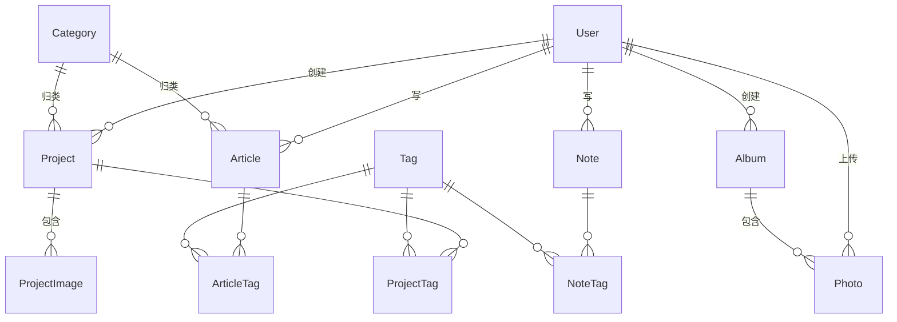

# 个人博客系统需求文档

> 版本：v1.1
> 最后更新：2026-07-18（稳定技术栈与视觉决策已统一）
> 项目代号：My-Blog

> **配套文档**：[docs/technology-baseline.md](./docs/technology-baseline.md)（技术版本唯一事实来源）· [docs/design-decisions.md](./docs/design-decisions.md)（设计决策与 Token）· [docs/visual-anchor.png](./docs/visual-anchor.png)（视觉锚图）

---

## 目录

1. [项目概述](#1-项目概述)
2. [核心目标与原则](#2-核心目标与原则)
3. [用户角色与权限](#3-用户角色与权限)
4. [功能需求](#4-功能需求)
5. [非功能需求](#5-非功能需求)
6. [UI/UX 设计规范](#6-uiux-设计规范)
7. [数据模型](#7-数据模型)
8. [技术栈](#8-技术栈)
9. [项目目录结构规划](#9-项目目录结构规划)
10. [开发阶段规划](#10-开发阶段规划)
11. [部署方案](#11-部署方案)
12. [风险与决策记录](#12-风险与决策记录)

---

## 1. 项目概述

### 1.1 项目简介

构建一个面向个人内容创作者的全栈动态博客系统，承载**长文、碎片笔记、摄影作品、相册**等多种内容形态，支持**公开与私密**内容并存，目标是打造一个具有个人辨识度、面向公众展示、同时保留私密记录能力的现代化博客平台。

### 1.2 项目目标

- **被看见**：支持 SEO、订阅、分享，让内容可被搜索引擎和读者发现
- **个人表达**：承载文章、笔记、摄影作品、相册等多种内容形式
- **公私分明**：支持公开内容和私密内容并存，灵活控制可见性
- **维护轻松**：后台编辑体验顺畅，降低持续创作的心理成本
- **现代审美**：视觉风格参考杂志卡片 + 大图沉浸，避免"看起来很 low"的问题

### 1.3 核心场景

| 场景     | 描述                                                   |
| -------- | ------------------------------------------------------ |
| 公开浏览 | 游客通过搜索引擎或直接访问，阅读公开文章、查看公开作品 |
| 私密访问 | 已登录朋友查看仅限朋友的私密内容                       |
| 内容创作 | 博主在后台撰写文章、上传作品、发布笔记                 |
| 内容订阅 | 读者通过 RSS 订阅博客更新                              |
| 站内探索 | 读者通过标签、分类、归档、搜索发现更多内容             |

### 1.4 不在范围内

- 多用户社区 / 多博主系统（单作者）
- 电商、付费内容、会员体系
- 实时聊天、IM
- 复杂的富文本所见即所得编辑器（采用 Markdown 即可）
- 移动端原生 App（响应式 Web 即可）

---

## 2. 核心目标与原则

### 2.1 设计原则

1. **内容为王**：后台所有功能围绕"如何让创作者顺畅地写、传、发"展开
2. **可见性是一等公民**：每条内容都必须考虑公开/私密/密码三种状态
3. **URL 用 slug**：所有公开内容用语义化 URL，不用纯数字 ID
4. **软删除优先**：删除操作优先软删除，避免误删
5. **类型驱动**：内容有明确的分类（文章/笔记/作品/照片），避免"四不像"
6. **响应式优先**：所有页面在桌面、平板、手机上都要可用

### 2.2 内容分层

| 层级 | 形态              | 长度          | 制作成本 | 更新频率      |
| ---- | ----------------- | ------------- | -------- | ------------- |
| 顶层 | 作品集（Project） | 多图 + 长描述 | 高       | 周/月         |
| 主力 | 文章（Article）   | 1000+ 字      | 中       | 周更 / 隔几天 |
| 日常 | 笔记（Note）      | 几行 - 几百字 | 低       | 任意          |
| 素材 | 照片（Photo）     | 单图          | 极低     | 任意          |

---

## 3. 用户角色与权限

### 3.1 角色定义

| 角色      | 数量          | 能力                                        |
| --------- | ------------- | ------------------------------------------- |
| **ADMIN** | 1（博主本人） | 全部能力：管理后台、CRUD 所有内容、用户管理 |
| **USER**  | N（朋友）     | 登录后可查看私密内容，**无后台权限**        |
| **GUEST** | 不限          | 仅可查看 PUBLIC 可见性内容                  |

### 3.2 可见性矩阵

| 角色 / 内容可见性 | PUBLIC | PRIVATE | PASSWORD   |
| ----------------- | ------ | ------- | ---------- |
| GUEST（未登录）   | ✅     | ❌      | ❌         |
| USER（已登录）    | ✅     | ✅      | 需输入密码 |
| ADMIN             | ✅     | ✅      | ✅         |

### 3.3 后台权限

- ADMIN 可访问 `/admin/*` 路由
- USER 访问 `/admin/*` 直接跳转首页
- 任何用户访问无权限内容均返回 404（不暴露资源是否存在）

### 3.4 认证方案

- 使用 NextAuth.js v4 Credentials Provider 实现邮箱 + 密码登录
- 密码使用 bcryptjs 哈希存储（cost 12）
- 使用 JWT Session，并由框架管理的 HTTP-only Cookie 持有会话令牌
- 提供"记住我"选项（延长 session 有效期）
- 后续可考虑接入 OAuth（GitHub / Google），但非必需

---

## 4. 功能需求

### 4.1 账号体系

#### 4.1.1 用户注册（仅 ADMIN 可创建）

- ADMIN 在后台创建用户账号
- 创建时填入：邮箱、用户名、初始密码
- 系统向用户邮箱发送初始密码（可选）
- 用户首次登录可修改密码

#### 4.1.2 用户登录

- 登录页：邮箱 + 密码
- 错误提示：邮箱或密码错误（不区分两者）
- 登录成功跳转到原目标页或首页
- 失败次数限制：5 次/15 分钟（防爆破）

#### 4.1.3 用户管理（ADMIN）

- 用户列表（邮箱、用户名、角色、最后登录时间）
- 创建用户
- 编辑用户信息
- 重置密码
- 禁用 / 启用账号
- 删除用户（软删除）

#### 4.1.4 个人资料

- 用户可修改：昵称、头像、密码
- 邮箱不可修改（或需通过验证流程）

---

### 4.2 文章（Article）

#### 4.2.1 数据特征

- **正式、完整、有结构**
- 长度：1000+ 字
- 制作：精雕细琢
- 必须有：标题、封面图、正文
- 可选：摘要、分类、标签

#### 4.2.2 字段

| 字段        | 类型     | 必填     | 说明                         |
| ----------- | -------- | -------- | ---------------------------- |
| slug        | string   | 自动生成 | URL 路径，允许手动覆盖       |
| title       | string   | ✅       | 标题                         |
| excerpt     | string   | 自动提取 | 摘要（200 字内）             |
| content     | markdown | ✅       | 正文（支持代码高亮）         |
| coverImage  | string   | ✅       | 封面图 URL                   |
| category    | string   | 可选     | 一个文章只能有一个分类       |
| tags        | string[] | 可选     | 多个标签                     |
| visibility  | enum     | ✅       | PUBLIC / PRIVATE / PASSWORD  |
| password    | string   | 视情况   | 仅 PASSWORD 可见性时需要     |
| status      | enum     | ✅       | DRAFT / PUBLISHED / ARCHIVED |
| featured    | boolean  | false    | 是否首页置顶                 |
| publishedAt | datetime | 自动     | 发布时间                     |
| viewCount   | int      | 0        | 阅读量                       |

#### 4.2.3 功能要求

- **Markdown 编辑器**：
  - 支持标题、列表、引用、链接、图片、代码块、表格
  - 代码块语言选择 + 实时高亮
  - 拖拽上传图片
  - 实时预览（分屏或切换）
- **自动保存草稿**：每 30 秒自动保存到本地 + 服务端
- **封面图管理**：
  - 上传图片
  - 自动生成多尺寸（原图/大图/中图/缩略图）
  - 支持裁剪（可选，后续）
- **slug 生成**：基于标题自动生成拼音 slug，可手动修改
- **可见性切换**：
  - PUBLIC：所有访客可见
  - PRIVATE：登录用户可见
  - PASSWORD：需要密码访问（朋友用密码"万能钥匙"或单篇密码）
- **状态流转**：
  - DRAFT → PUBLISHED：发布
  - PUBLISHED → DRAFT：转草稿
  - PUBLISHED → ARCHIVED：归档（从前台隐藏但保留 URL）
- **阅读量统计**：同一会话内多次刷新只计一次
- **代码高亮**：使用 Shiki 或 Prism，支持所有主流语言

#### 4.2.4 前台展示

- **列表页**：
  - 卡片网格（3 列 → 2 列 → 1 列 响应式）
  - 每张卡片：封面图 + 标题 + 摘要 + 发布时间 + 分类
  - 支持按分类筛选、标签筛选、分页/无限滚动
- **详情页**：
  - 顶部：全宽封面图（16:9 沉浸感）
  - 标题区：标题、发布时间、分类、阅读量
  - 正文区：居中单栏，最大宽度 720px，行高 1.8
  - 文末：标签云、分享按钮、相关文章
  - 私密/密码文章：无权限时显示输入框或登录提示

#### 4.2.5 SEO

- 自动生成 Open Graph 标签（标题、描述、封面）
- 自动生成 Twitter Card
- 自动生成结构化数据（Article schema.org）
- 自动生成 sitemap.xml 条目

---

### 4.3 笔记（Note）

#### 4.3.1 定位

**数字花园（Digital Garden）** 风格的碎片化内容，是文章的轻量补充。

#### 4.3.2 字段

| 字段        | 类型     | 必填   | 说明                        |
| ----------- | -------- | ------ | --------------------------- |
| slug        | string   | 自动   |                             |
| title       | string   | 可选   | 笔记可以无标题              |
| content     | markdown | ✅     | 正文（短）                  |
| visibility  | enum     | ✅     | PUBLIC / PRIVATE / PASSWORD |
| password    | string   | 视情况 |                             |
| status      | enum     | ✅     | DRAFT / PUBLISHED           |
| publishedAt | datetime | 自动   |                             |
| viewCount   | int      | 0      |                             |

> 笔记**没有**封面图、分类、置顶字段，保持轻量。

#### 4.3.3 与文章的区别

| 维度     | 文章               | 笔记            |
| -------- | ------------------ | --------------- |
| 长度     | 1000+ 字           | 几行 - 几百字   |
| 封面图   | 必填               | 无              |
| 分类     | 必填/可选          | 无              |
| 列表样式 | 杂志卡片           | 紧凑列表        |
| 详情样式 | 沉浸式封面 + 排版  | 极简单栏        |
| URL 风格 | `/articles/[slug]` | `/notes/[slug]` |
| SEO 权重 | 高                 | 中              |

#### 4.3.4 前台展示

- **列表页 `/notes`**：
  - 紧凑列表（一行一条）
  - 显示：标题（可空）、前 100 字摘要、发布时间、可见性标记
- **详情页 `/notes/[slug]`**：
  - 极简单栏，最大宽度 720px
  - 顶部小标题区
  - 正文 Markdown 渲染（带代码高亮）
  - 文末：发布时间、相关笔记推荐

#### 4.3.5 后台编辑

- 与文章共用 Markdown 编辑器组件
- 笔记编辑器更简洁：移除封面图、分类字段
- 笔记列表页（后台）显示更紧凑

---

### 4.4 作品集（Project）

#### 4.4.1 定位

**Behance 风格的大图沉浸式作品展示**，用于摄影、设计、个人项目等强视觉内容。

#### 4.4.2 字段

#### Project 表

| 字段        | 类型     | 必填   | 说明                        |
| ----------- | -------- | ------ | --------------------------- |
| slug        | string   | 自动   |                             |
| title       | string   | ✅     | 作品名                      |
| description | text     | ✅     | 作品描述                    |
| coverImage  | string   | 自动   | 封面（首图或单独指定）      |
| category    | string   | 可选   |                             |
| tags        | string[] | 可选   |                             |
| visibility  | enum     | ✅     | PUBLIC / PRIVATE / PASSWORD |
| password    | string   | 视情况 |                             |
| status      | enum     | ✅     | DRAFT / PUBLISHED           |
| featured    | boolean  | false  | 是否首页精选                |
| order       | int      | 999    | 手动排序                    |
| publishedAt | datetime | 自动   |                             |
| viewCount   | int      | 0      |                             |

#### ProjectImage 表

| 字段      | 类型   | 必填 | 说明     |
| --------- | ------ | ---- | -------- |
| projectId | FK     | ✅   | 所属作品 |
| imageUrl  | string | ✅   |          |
| caption   | string | 可选 | 图片说明 |
| order     | int    | 0    | 排序     |
| width     | int    | 自动 | 原始宽度 |
| height    | int    | 自动 | 原始高度 |

#### 4.4.3 前台展示

- **列表页 `/projects`**：
  - 大图卡片网格（杂志风 + 大图占主导）
  - 每张卡片：大幅预览图 + 标题 + 简短描述
- **详情页 `/projects/[slug]`**：
  - 顶部：标题、描述、元信息
  - 主体：图片按 order 顺序纵向排列，全宽沉浸
  - 支持单张图片点击放大（灯箱效果）
  - 文末：其他作品推荐

---

### 4.5 相册（Album + Photo）

#### 4.5.1 定位

**Pinterest 风格瀑布流**的照片集合，用于生活照片、单图分享等。

#### 4.5.2 字段

#### Album 表

| 字段        | 类型     | 必填 | 说明                      |
| ----------- | -------- | ---- | ------------------------- |
| slug        | string   | 自动 |                           |
| title       | string   | ✅   | 相册名（如"2025 西藏行"） |
| description | text     | 可选 |                           |
| coverImage  | string   | 自动 | 封面（首图）              |
| visibility  | enum     | ✅   |                           |
| status      | enum     | ✅   |                           |
| publishedAt | datetime | 自动 |                           |

#### Photo 表

| 字段         | 类型     | 必填 | 说明            |
| ------------ | -------- | ---- | --------------- |
| title        | string   | 可选 |                 |
| description  | text     | 可选 |                 |
| imageUrl     | string   | ✅   |                 |
| thumbnailUrl | string   | 自动 | 缩略图          |
| location     | string   | 可选 | 拍摄地点        |
| takenAt      | date     | 可选 | 拍摄时间        |
| albumId      | FK       | 可空 | 独立照片为 null |
| visibility   | enum     | ✅   |                 |
| status       | enum     | ✅   |                 |
| width        | int      | 自动 |                 |
| height       | int      | 自动 |                 |
| order        | int      | 0    |                 |
| createdAt    | datetime | 自动 |                 |

#### 4.5.3 关系

- 一个 Album 可包含多张 Photo（一对多）
- Photo 可不属于任何 Album（独立照片，`albumId = null`）
- 瀑布流展示时，相册内照片和独立照片混合展示

#### 4.5.4 前台展示

- **瀑布流总览页 `/photos`**：
  - 全部照片（无论是否属于相册）按时间倒序瀑布流
  - 按 `height/width` 比例计算每张图片占位
  - 支持按相册筛选
  - 支持按可见性筛选（登录后显示更多）
- **相册详情页 `/photos/albums/[slug]`**：
  - 该相册内的所有照片瀑布流
  - 顶部：相册标题、描述、照片数量
- **照片详情（弹窗/独立页）**：
  - 灯箱效果显示原图
  - 显示：标题、描述、拍摄时间、地点
  - 上一张/下一张导航

#### 4.5.5 上传要求

- 支持拖拽多文件批量上传
- 上传时自动提取 EXIF 信息（拍摄时间、相机、镜头等）
- 自动生成多尺寸（缩略图 / 中图 / 大图）
- 显示上传进度

---

### 4.6 分类与标签

#### 4.6.1 分类（Category）

- **范围**：仅文章、作品集有分类
- **字段**：name、slug、description、type（ARTICLE/PROJECT）、order
- **管理**：后台 CRUD
- **前台**：
  - 列表页侧边栏显示所有分类及文章数
  - 点击分类进入该分类的文章列表

#### 4.6.2 标签（Tag）

- **范围**：文章、笔记、作品集都可以打标签
- **字段**：name、slug、description、color（可选）
- **管理**：后台 CRUD
- **前台**：
  - 文章/笔记详情页底部显示标签
  - 全站标签云页面 `/tags`
  - 点击标签查看所有相关内容（混合显示）

#### 4.6.3 关联表

- ArticleTag、NoteTag、ProjectTag 三个中间表
- 联合主键（防重复）

---

### 4.7 单页内容

#### 4.7.1 关于我（About）

- **路由**：`/about`
- **内容**：Markdown 编辑（个人介绍、技能、经历等）
- **扩展字段（JSON）**：
  - avatar（头像 URL）
  - socialLinks（社交链接数组）
  - skills（技能标签）
  - timeline（时间线事件）
- **唯一性**：全站只有一条记录
- **后台**：单页编辑器（特殊布局）

#### 4.7.2 Now 页面

- **路由**：`/now`
- **灵感来源**：[Derek Sivers 的 Now 页面](https://sivers.org/now)
- **内容**：当前在做什么、在读什么、关注什么
- **特性**：
  - 显示最后更新时间
  - 鼓励高频更新（每周/每月）
  - 显示历史版本（可选）

#### 4.7.3 数据模型

| 字段      | 类型     | 说明        |
| --------- | -------- | ----------- |
| id        | string   | UUID        |
| type      | enum     | ABOUT / NOW |
| content   | markdown | 正文        |
| meta      | json     | 扩展字段    |
| createdAt | datetime |             |
| updatedAt | datetime |             |

---

### 4.8 后台管理

#### 4.8.1 布局

- 左侧导航 + 右侧主内容
- 顶部用户信息 + 退出
- 响应式：移动端导航折叠为抽屉

#### 4.8.2 功能模块

| 模块     | 功能                                       |
| -------- | ------------------------------------------ |
| 仪表盘   | 内容统计、最近发布、快速入口               |
| 文章管理 | 列表、新建、编辑、删除、批量操作           |
| 笔记管理 | 列表、新建、编辑、删除                     |
| 作品管理 | 列表、新建（含多图上传）、编辑、删除       |
| 相册管理 | 相册 CRUD、照片上传                        |
| 分类管理 | CRUD、排序                                 |
| 标签管理 | CRUD、合并                                 |
| 单页管理 | 关于我、Now 编辑                           |
| 用户管理 | 列表、新建、编辑、禁用、删除               |
| 媒体库   | 所有上传文件的统一管理（搜索、按类型筛选） |
| 系统设置 | 站点标题、Logo、SEO 设置、可见性默认设置   |

#### 4.8.3 编辑器

- **Markdown 编辑器**：
  - 左侧编辑，右侧实时预览
  - 工具栏：标题、加粗、斜体、链接、图片、代码块、引用、列表
  - 图片上传：拖拽 / 粘贴 / 选择
  - 代码块：语言选择 + 行号 + 复制按钮
  - 自动保存草稿（30 秒一次）
  - 快捷键支持（Cmd+B 加粗等）

#### 4.8.4 文件上传

- 支持单文件 / 多文件 / 拖拽 / 粘贴
- 客户端预处理：压缩到合理尺寸（最大边 2400px）
- 服务端：保存到 `public/uploads/YYYY/MM/`，数据库存 URL
- 进度反馈
- 失败重试

---

## 5. 非功能需求

### 5.1 性能

- **首屏加载**（桌面端）：< 2 秒
- **Lighthouse 分数**：性能 > 85，可访问性 > 90，最佳实践 > 90
- **图片优化**：
  - 自动生成 WebP / AVIF 格式
  - 响应式 `srcset` 多尺寸
  - 懒加载（非首屏图片）
  - 模糊占位图（base64 blur placeholder）
- **代码分割**：路由级 + 组件级懒加载
- **数据库索引**：slug、publishedAt、status、visibility 等关键字段
- **缓存策略**：
  - 静态资源：强缓存（Cache-Control: public, max-age=31536000, immutable）
  - HTML 页面：协商缓存
  - API：按需缓存

### 5.2 安全

- **密码**：bcrypt 加密（cost factor 12）
- **CSRF**：所有写操作要求 CSRF token
- **XSS**：
  - Markdown 渲染时白名单过滤
  - HTML 内容采用严格白名单净化，默认禁用不受信任的原始 HTML
  - Content Security Policy
- **SQL 注入**：使用 ORM（Prisma）参数化查询
- **文件上传**：
  - 白名单 MIME 类型
  - 文件大小限制（图片 10MB）
  - 服务端二次校验文件类型
- **登录限流**：5 次/15 分钟
- **HTTPS**：部署时强制 HTTPS
- **私密内容**：无权限访问时返回 404，不暴露资源存在性
- **依赖安全**：定期 npm audit，Dependabot

### 5.3 SEO

- 每篇文章/笔记/作品有独立 `<title>`、`<meta description>`、Open Graph
- 自动生成 sitemap.xml
- 自动生成 robots.txt
- 自动生成 RSS/Atom feed
- 结构化数据（JSON-LD）：Article、ImageObject、Person
- 规范 URL（canonical link）
- 移动端友好（响应式）

### 5.4 可访问性（A11y）

- 所有图片有 `alt` 属性
- 颜色对比度满足 WCAG AA 标准
- 键盘可导航（Tab、Enter、Esc）
- 表单有 label 关联
- 焦点状态明显

### 5.5 浏览器兼容

- Chrome / Edge / Safari / Firefox 最新两个大版本
- iOS Safari 15+、Android Chrome 90+
- 不支持 IE

### 5.6 响应式断点

| 断点    | 宽度       | 列数             |
| ------- | ---------- | ---------------- |
| mobile  | < 640px    | 1 列             |
| tablet  | 640-1024px | 2 列             |
| desktop | > 1024px   | 3 列             |
| wide    | > 1440px   | 4 列（部分页面） |

### 5.7 国际化（暂缓）

- 第一期仅支持中文
- 架构上预留 i18n 扩展能力（字符串集中管理）

---

## 6. UI/UX 设计规范

### 6.1 设计风格定位

**杂志卡片风（少数派）+ 大图沉浸风（Behance 个人作品集）** 的融合：

- 列表页/首页：杂志卡片网格
- 作品集/相册详情：大图沉浸式
- 文章/笔记详情：杂志感 + 舒适阅读

### 6.2 设计系统

#### 6.2.1 颜色

```
主色 / 强调橙  #E85A2C    ← 按钮、链接、强调、活跃状态（2026-07-18 调整：原 #FF6B35 微调为更浓的番茄橙）
辅色 / 文字黑  #1A1A1A    ← 主文字、标题
辅色 / 文字灰  #6B7280    ← 次要文字、元信息
辅色 / 边框灰  #E5E7EB    ← 分割线、卡片边框
底色 / 米白    #FAFAFA    ← 页面背景
纯白          #FFFFFF    ← 卡片背景
点缀 / 成功绿  #10B981    ← 成功状态
点缀 / 警告红  #EF4444    ← 错误、删除、危险
```

#### 6.2.2 字体

| 用途     | 字体                             |
| -------- | -------------------------------- |
| 中文标题 | 思源宋体（Source Han Serif）     |
| 中文正文 | 思源黑体（Source Han Sans）      |
| 英文     | Inter                            |
| 代码     | JetBrains Mono                   |
| 装饰     | 霞鹜文楷（可选，用于引用、签名） |

字体加载：使用 `next/font` 进行子集化 + 预加载

#### 6.2.3 排版规则

- 栅格：12 列响应式
- 圆角：`4-8px`（小圆角）
- 阴影：极轻 `0 1px 3px rgba(0,0,0,0.05)`，或不用
- 留白：慷慨，桌面端卡片间距 `24-32px`
- 正文行高：`1.8`
- 标题与正文间距：`1.5em`

> 📐 **2026-07-18 注**：通用栅格约定——
>
> - 列表页（首页/文章列表/作品列表）卡片栅格统一为 **3 列**（lg 3 / md 2 / sm 1）
> - 详情页正文列最大宽度 **720px** 居中

#### 6.2.4 组件

- Button：主要、次要、文字、危险 4 种
- Card：标准卡片（封面+标题+摘要+元信息）
- Input：文本框、文本域
- Modal：用于确认、灯箱
- Toast：成功/错误/警告 通知
- Tag：标签展示
- Avatar：用户头像

### 6.3 关键页面示意

#### 6.3.1 首页

```
┌─────────────────────────────────────────────────────────┐
│ 小川记事  一个独立创作者的日常与记录    首页  文章  笔记  作品  相册  关于  🔍  登录  │
├─────────────────────────────────────────────────────────┤
│                                                         │
│  ┌───────────────────────────────────────────────────┐  │
│  │           [封面大图 - 16:9 沉浸]                  │  │
│  │     置顶文章标题  ← 大字，衬线体                  │  │
│  │     一句话副标题                                    │  │
│  └───────────────────────────────────────────────────┘  │
│                                                         │
│  最新文章                                  查看全部 →   │
│  ┌─────────┐  ┌─────────┐  ┌─────────┐                  │
│  │ [缩略图] │  │ [缩略图] │  │ [缩略图] │                 │
│  │  标题    │  │  标题    │  │  标题    │                  │
│  │  摘要    │  │  摘要    │  │  摘要    │                  │
│  │ 3天前·摄影│  │ 1周前·代码│  │ 2周前·随笔│              │
│  └─────────┘  └─────────┘  └─────────┘                  │
│                                                         │
│  作品精选                                  查看全部 →   │
│  ┌─────────┐  ┌─────────┐  ┌─────────┐                  │
│  │  [大图]  │  │  [大图]  │  │  [大图]  │                 │
│  │  作品名  │  │  作品名  │  │  作品名  │                 │
│  └─────────┘  └─────────┘  └─────────┘                  │
│                                                         │
│  最新笔记                                  查看全部 →   │
│  ─ 笔记标题 (3天前)                                     │
│  ─ 笔记标题 (5天前)                                     │
│  ─ 笔记标题 (1周前)                                     │
│                                                         │
│  ┌──────────────────────────────────────────────────┐   │
│  │  [头像]  关于我 - 一句话介绍                       │   │
│  └──────────────────────────────────────────────────┘   │
│                                                         │
│  © 2026 · Powered by you                                │
└─────────────────────────────────────────────────────────┘
```

> 📐 **2026-07-18 设计决策**：首页"最新文章"和"作品精选"卡片栅格**锁定为 3 列**（响应式：≥1024px 3 列，≥640px 2 列，<640px 1 列）。
>
> 详见 [docs/design-decisions.md](./docs/design-decisions.md) 决策 3。

#### 6.3.2 文章详情页

```
┌─────────────────────────────────────────────────────────┐
│                    [顶部导航]                            │
├─────────────────────────────────────────────────────────┤
│                                                         │
│           [封面大图 - 全宽，16:9 沉浸]                  │
│                                                         │
│              分类: 摄影 | 标签: #胶片 #旅行              │
│         《  文章标题 - 大字，居中，衬线体  》            │
│         发布于 2026-07-16 · 阅读 1.2k                    │
│                                                         │
├─────────────────────────────────────────────────────────┤
│   ┌────────── 居中正文（最大 720px）──────────┐          │
│   │  段落文字... 思源黑体，行高 1.8          │          │
│   │                                           │          │
│   │  ┌── 代码块（高亮 + 复制按钮）──┐        │          │
│   │  │ const hello = 'world';        │        │          │
│   │  └─────────────────────────────┘        │          │
│   │                                           │          │
│   │  段落文字...                              │          │
│   └───────────────────────────────────────────┘          │
│                                                         │
│   标签: #胶片 #旅行  ·  分享到: [微博][Twitter][复制]  │
│   ─── 相关文章 ───                                       │
│   ─── 评论区 ───                                        │
└─────────────────────────────────────────────────────────┘
```

#### 6.3.3 作品集详情页

```
┌─────────────────────────────────────────────────────────┐
│                    [顶部导航]                            │
├─────────────────────────────────────────────────────────┤
│              《  作品标题 - 居中大字  》                │
│              2026-07-16 · #摄影 #旅行                   │
│              作品简介（1-2 句话）                        │
├─────────────────────────────────────────────────────────┤
│         [全屏大图 1 - 16:9，宽 100%]                    │
│         [全屏大图 2 - 4:3，宽 100%]                     │
│         [全屏大图 3 - 竖图，居中 70%]                   │
│         [全屏大图 4 - 16:9，宽 100%]                    │
├─────────────────────────────────────────────────────────┤
│              作品描述（多段正文）                        │
│              ── 拍摄时间 / 地点 / 设备 ──                │
│              其他作品 →                                  │
└─────────────────────────────────────────────────────────┘
```

#### 6.3.4 相册瀑布流页

```
┌─────────────────────────────────────────────────────────┐
│  相册 | 全部  ▼    排序：最新 ▼                          │
├─────────────────────────────────────────────────────────┤
│  ┌─────┐  ┌──────┐  ┌───┐  ┌──────┐                     │
│  │     │  │      │  │   │  │      │  ← 不同高度        │
│  │     │  │      │  │   │  │      │                     │
│  └─────┘  │      │  └───┘  │      │                     │
│  ┌──────┐  │      │  ┌─────┐  └──────┘                   │
│  │      │  └──────┘  │     │                            │
│  │      │  ┌───┐      │     │                            │
│  └──────┘  │   │      └─────┘                            │
│            └───┘                                        │
└─────────────────────────────────────────────────────────┘
```

#### 6.3.5 后台布局

```
┌─────────────────────────────────────────────────────────┐
│ ┌────────┐ ┌──────────────────────────────────────────┐ │
│ │  后台   │ │  欢迎回来，昵称                          │ │
│ │        │ │  ─────────────────                       │ │
│ │ 仪表盘 │ │  内容统计                                │ │
│ │ 文章   │ │  [文章: 23] [笔记: 87] [作品: 5] [照片:156]│
│ │ 笔记   │ │                                          │ │
│ │ 作品   │ │  最近发布                                │ │
│ │ 相册   │ │  ─ 《如何学习 Next.js》2天前              │ │
│ │ 分类   │ │  ─ 《我去了趟西藏》5天前                  │ │
│ │ 标签   │ │                                          │ │
│ │ 单页   │ │  快速操作                                │ │
│ │ 用户   │ │  [+ 新建文章] [+ 新建笔记] [+ 上传照片]   │ │
│ │ 媒体库 │ │                                          │ │
│ │ 设置   │ │                                          │ │
│ │        │ │                                          │ │
│ │ 退出   │ │                                          │ │
│ └────────┘ └──────────────────────────────────────────┘ │
└─────────────────────────────────────────────────────────┘
```

---

## 7. 数据模型

### 7.1 ER 图



### 7.2 表清单（共 11 张）

| 序号 | 表名         | 用途                  | 归属模块 |
| ---- | ------------ | --------------------- | -------- |
| 1    | User         | 用户                  | 系统     |
| 2    | Article      | 文章                  | 内容     |
| 3    | Note         | 笔记                  | 内容     |
| 4    | Project      | 作品集                | 内容     |
| 5    | ProjectImage | 作品集图片            | 内容     |
| 6    | Album        | 相册                  | 内容     |
| 7    | Photo        | 照片                  | 内容     |
| 8    | Category     | 分类                  | 组织     |
| 9    | Tag          | 标签                  | 组织     |
| 10   | ArticleTag   | 文章-标签关联         | 组织     |
| 11   | NoteTag      | 笔记-标签关联         | 组织     |
| 12   | ProjectTag   | 作品-标签关联         | 组织     |
| 13   | Page         | 单页内容（About/Now） | 内容     |

### 7.3 关键字段约定

#### 通用字段

每张内容表（Article/Note/Project/Photo/Album）都包含：

| 字段        | 类型          | 说明                         |
| ----------- | ------------- | ---------------------------- |
| id          | String (UUID) | 主键                         |
| slug        | String        | URL 唯一标识                 |
| visibility  | Enum          | PUBLIC / PRIVATE / PASSWORD  |
| password    | String?       | 仅 PASSWORD 时使用           |
| status      | Enum          | DRAFT / PUBLISHED / ARCHIVED |
| publishedAt | DateTime?     |                              |
| createdAt   | DateTime      |                              |
| updatedAt   | DateTime      |                              |
| deletedAt   | DateTime?     | 软删除标记                   |
| viewCount   | Int           | 阅读量                       |

#### 可见性枚举

```
PUBLIC    公开 - 任何人可见
PRIVATE   私密 - 仅登录用户可见
PASSWORD  密码 - 需输入密码访问
```

#### 状态枚举

```
DRAFT      草稿 - 不在前台展示
PUBLISHED  已发布 - 在前台展示
ARCHIVED   已归档 - 在前台隐藏但保留 URL
```

### 7.4 索引策略

```sql
-- 关键索引
CREATE INDEX idx_article_slug ON Article(slug);
CREATE INDEX idx_article_published ON Article(publishedAt DESC) WHERE status = 'PUBLISHED' AND deletedAt IS NULL;
CREATE INDEX idx_article_visibility ON Article(visibility);

-- 文章列表查询的常见过滤
-- WHERE status='PUBLISHED' AND deletedAt IS NULL AND visibility IN (...) ORDER BY publishedAt DESC
```

---

## 8. 技术栈

> 完整版本矩阵、参考补丁、安装阶段和升级规则统一维护在 [docs/technology-baseline.md](./docs/technology-baseline.md)。本章只保留架构选型摘要；出现差异时，以技术基线文档为准。

### 8.1 全栈选型

| 层级           | 统一选型                                                           |
| -------------- | ------------------------------------------------------------------ |
| 运行环境       | **Node.js 24 LTS** + **pnpm 10**                                   |
| 框架           | **Next.js 15.5（App Router，Maintenance LTS）**                    |
| 视图层         | **React / React DOM 19.1**                                         |
| 语言           | **TypeScript 5.9**                                                 |
| 样式           | **Tailwind CSS 3.4** + **shadcn/ui CLI 3**                         |
| 数据库（本地） | **SQLite**（通过 Prisma）                                          |
| 数据库（生产） | **PostgreSQL 17**（部署时切换）                                    |
| ORM            | **Prisma 6.19**                                                    |
| 认证           | **NextAuth.js 4.24**：Credentials + JWT Session + HTTP-only Cookie |
| Markdown       | **next-mdx-remote 5** + **remark/rehype** 插件                     |
| 代码高亮       | **rehype-pretty-code + Shiki 3**                                   |
| 图片处理       | **sharp 0.34**（服务端生成多尺寸）                                 |
| 表单           | **react-hook-form 7** + **Zod 3.25**                               |
| 状态管理       | **React Server Components + Server Actions**（无需 Redux/Zustand） |
| 图标           | **lucide-react 0.577**                                             |
| 部署           | **Vercel** / **自建 Docker**                                       |

### 8.2 依赖分类与安装边界

Phase 0 只安装脚手架所需依赖，其他包在首次使用的阶段加入，避免未使用依赖提前进入项目。

**Phase 0 运行时依赖**：

```text
next, react, react-dom, @prisma/client
```

**Phase 0 开发依赖**：

```text
typescript, @types/node, @types/react, @types/react-dom,
tailwindcss, postcss, autoprefixer, prisma,
eslint, eslint-config-next, prettier
```

**后续阶段按需加入**：

```text
Phase 1: next-auth, bcryptjs, react-hook-form, zod, vitest
Phase 2: lucide-react 与具体 shadcn/ui 组件依赖
Phase 3: next-mdx-remote, remark-gfm, rehype-slug,
         rehype-autolink-headings, rehype-pretty-code, shiki
Phase 5-6: sharp（若此前尚未安装）
按需工具: husky, lint-staged
```

具体版本不得使用 `latest` 或预发布标签，按技术基线确定版本并由 `pnpm-lock.yaml` 锁定。

### 8.3 shadcn/ui 选用的组件

```text
button, card, input, textarea, dialog, dropdown-menu,
tabs, toast, badge, avatar, separator, switch, label
```

shadcn/ui CLI 使用固定的 3.x 版本通过 `pnpm dlx` 执行；生成的组件代码归项目所有。

### 8.4 工具链

- **包管理**：pnpm 10（`packageManager` 字段固定具体版本）
- **代码规范**：ESLint 9 + `eslint-config-next` 15.5 + Prettier 3
- **Git Hooks**：Husky 9 + lint-staged 16（可选）
- **测试**：Vitest 3（首次编写单元测试时安装）
- **CI/CD**：GitHub Actions（后续，使用 `pnpm install --frozen-lockfile`）

### 8.5 关键兼容约束

- React 与 React DOM 必须严格同版。
- Prisma CLI 与 `@prisma/client` 必须严格同版。
- Next.js 与 `eslint-config-next` 必须保持相同版本线。
- Tailwind CSS 固定使用 3.4 的 `tailwind.config.ts` 配置模型。
- NextAuth.js 固定使用稳定的 v4，不使用仍处于 beta 的 v5。
- 主版本升级必须单独记录技术决策，不随普通依赖更新进行。

---

## 9. 项目目录结构规划

```
my-blog/
├── prisma/
│   ├── schema.prisma              # 数据库 schema
│   ├── migrations/                # 迁移文件
│   └── seed.ts                    # 种子数据（创建 admin 账号）
├── public/
│   ├── uploads/                   # 用户上传的文件
│   │   └── YYYY/MM/
│   └── static/                    # 静态资源（Logo 等）
├── src/
│   ├── app/                       # Next.js App Router
│   │   ├── (frontend)/            # 前台路由组
│   │   │   ├── page.tsx           # 首页
│   │   │   ├── articles/
│   │   │   │   ├── page.tsx       # 文章列表
│   │   │   │   └── [slug]/page.tsx
│   │   │   ├── notes/
│   │   │   │   ├── page.tsx       # 笔记列表
│   │   │   │   └── [slug]/page.tsx
│   │   │   ├── projects/
│   │   │   │   ├── page.tsx
│   │   │   │   └── [slug]/page.tsx
│   │   │   ├── photos/
│   │   │   │   ├── page.tsx       # 瀑布流
│   │   │   │   └── albums/[slug]/page.tsx
│   │   │   ├── tags/
│   │   │   │   ├── page.tsx       # 标签云
│   │   │   │   └── [slug]/page.tsx
│   │   │   ├── categories/[slug]/page.tsx
│   │   │   ├── archive/page.tsx   # 归档
│   │   │   ├── about/page.tsx
│   │   │   ├── now/page.tsx
│   │   │   ├── login/page.tsx
│   │   │   ├── search/page.tsx
│   │   │   ├── feed.xml/route.ts  # RSS
│   │   │   ├── sitemap.xml/route.ts
│   │   │   ├── robots.txt/route.ts
│   │   │   └── layout.tsx         # 前台布局
│   │   ├── (admin)/               # 后台路由组
│   │   │   └── admin/
│   │   │       ├── layout.tsx     # 后台布局
│   │   │       ├── page.tsx       # 仪表盘
│   │   │       ├── articles/
│   │   │       ├── notes/
│   │   │       ├── projects/
│   │   │       ├── photos/
│   │   │       ├── categories/
│   │   │       ├── tags/
│   │   │       ├── pages/         # About / Now
│   │   │       ├── users/
│   │   │       ├── media/         # 媒体库
│   │   │       └── settings/
│   │   ├── api/                   # API 路由
│   │   │   ├── auth/[...nextauth]/route.ts
│   │   │   ├── upload/route.ts
│   │   │   └── ...
│   │   ├── globals.css
│   │   └── layout.tsx             # 根布局
│   ├── components/
│   │   ├── ui/                    # shadcn/ui 组件
│   │   ├── frontend/              # 前台组件
│   │   │   ├── ArticleCard.tsx
│   │   │   ├── NoteList.tsx
│   │   │   ├── ProjectCard.tsx
│   │   │   ├── PhotoMasonry.tsx
│   │   │   ├── Header.tsx
│   │   │   ├── Footer.tsx
│   │   │   ├── MarkdownRenderer.tsx
│   │   │   ├── PasswordPrompt.tsx
│   │   │   └── ...
│   │   ├── admin/                 # 后台组件
│   │   │   ├── Editor/
│   │   │   ├── ImageUploader.tsx
│   │   │   ├── Sidebar.tsx
│   │   │   └── ...
│   │   └── shared/                # 共享组件
│   ├── lib/
│   │   ├── auth.ts                # 认证配置
│   │   ├── db.ts                  # Prisma 客户端单例
│   │   ├── visibility.ts          # 可见性校验
│   │   ├── slug.ts                # slug 生成
│   │   ├── markdown.ts            # Markdown 渲染
│   │   ├── image.ts               # 图片处理
│   │   ├── api.ts                 # API 客户端封装
│   │   └── utils.ts
│   ├── server/                    # 服务端逻辑
│   │   ├── articles.ts
│   │   ├── notes.ts
│   │   ├── projects.ts
│   │   ├── photos.ts
│   │   ├── users.ts
│   │   └── ...
│   ├── types/                     # TypeScript 类型定义
│   │   ├── article.ts
│   │   ├── note.ts
│   │   └── ...
│   └── styles/
├── .env.example                   # 环境变量示例
├── .env                           # 本地环境变量（gitignore）
├── .gitignore
├── README.md
├── REQUIREMENTS.md                # 本文档
├── next.config.mjs
├── postcss.config.mjs
├── tailwind.config.ts
├── eslint.config.mjs
├── .prettierrc.json
├── components.json               # shadcn/ui CLI 配置
├── tsconfig.json
├── .nvmrc                        # Node.js 24 LTS
├── package.json                  # 含 packageManager: pnpm@10.x
└── pnpm-lock.yaml
```

---

## 10. 开发阶段规划

### 第一期：MVP（核心功能，约 4-6 周）

**目标**：本地能跑通核心写、读、看流程

- [ ] 项目初始化（Next.js 15.5 + React 19.1 + TypeScript 5.9 + Tailwind CSS 3.4 + Prisma 6.19）
- [ ] 数据库 schema 设计 + 迁移
- [ ] shadcn/ui 初始化 + 设计系统搭建
- [ ] 认证系统（登录、Session、权限中间件）
- [ ] 后台基础布局（侧边栏 + 顶栏）
- [ ] 文章 CRUD（编辑器 + 代码高亮 + 可见性）
- [ ] 文章前台（列表 + 详情 + 标签 + 分类）
- [ ] 笔记 CRUD + 前台（极简列表 + 详情）
- [ ] 作品集 CRUD（含多图上传）+ 前台（大图沉浸）
- [ ] 相册 + 照片瀑布流
- [ ] 分类、标签管理
- [ ] About / Now 单页
- [ ] 首页（杂志卡片 + 置顶大图）
- [ ] 图片上传 + 多尺寸生成
- [ ] Markdown 渲染 + 代码高亮
- [ ] 响应式适配
- [ ] 可见性权限控制
- [ ] 基础 SEO（title、meta、OG）
- [ ] 软删除
- [ ] 自动保存草稿

### 第二期：体验提升（约 2-3 周）

- [ ] 评论 / 留言板
- [ ] RSS / Atom feed
- [ ] 站内搜索
- [ ] sitemap.xml / robots.txt
- [ ] 阅读量统计 + 防刷
- [ ] 结构化数据（JSON-LD）
- [ ] 图片灯箱
- [ ] 暗色模式
- [ ] 媒体库（统一管理所有文件）
- [ ] 数据导入导出（Markdown 导入）

### 第三期：部署 + 优化（约 1-2 周）

- [ ] 切换到 PostgreSQL 17
- [ ] 切换到云存储（Cloudflare R2 / 阿里云 OSS）
- [ ] Vercel 部署
- [ ] 自定义域名
- [ ] HTTPS
- [ ] 性能优化（缓存、图片优化、CDN）
- [ ] 监控（Vercel Analytics / Plausible）
- [ ] 备份策略

### 第四期：锦上添花（持续）

- [ ] OAuth 登录（GitHub）
- [ ] 多语言支持
- [ ] Newsletter 邮件订阅
- [ ] AI 辅助（自动生成摘要、标签）
- [ ] PWA 支持
- [ ] 全文搜索（MeiliSearch / Algolia）
- [ ] 移动端 App（Capacitor）

---

## 11. 部署方案

### 11.1 本地开发环境

- 操作系统：Windows 11 / macOS / Linux
- Node.js：24 LTS（使用当前 24.x 安全补丁）
- pnpm：10.x（具体版本由 `package.json#packageManager` 固定）
- 数据库：SQLite（由 Prisma 管理，无需额外安装）
- 文件存储：本地 `public/uploads/`
- 启动：`pnpm dev`，访问 `http://localhost:3000`

### 11.2 生产部署（推荐方案）

#### 方案 A：Vercel + Cloudflare R2 + Neon Postgres

| 组件     | 服务                                            |
| -------- | ----------------------------------------------- |
| 应用     | Vercel（免费额度足够个人博客）                  |
| 数据库   | Neon Postgres（兼容 PostgreSQL 17，Serverless） |
| 文件存储 | Cloudflare R2（10GB 免费）                      |
| 域名     | Cloudflare 注册 + 解析                          |
| 监控     | Vercel Analytics                                |

**优点**：零运维，扩展性强，免费层够用  
**缺点**：依赖第三方，国内访问速度一般

#### 方案 B：自建 VPS + Docker

| 组件     | 服务                           |
| -------- | ------------------------------ |
| 服务器   | 阿里云 / 腾讯云 轻量应用服务器 |
| 应用     | Docker 容器                    |
| 数据库   | PostgreSQL 17（Docker）        |
| 文件存储 | 本地磁盘（定期备份）           |
| 反向代理 | Nginx + Let's Encrypt HTTPS    |

**优点**：完全可控，国内访问快  
**缺点**：需要运维，备份、安全更新都要自己做

### 11.3 备份策略

- **数据库**：每日自动备份到对象存储
- **文件**：实时同步到云存储
- **配置**：版本控制（Git）

### 11.4 域名建议

- 简短易记
- 优先 `.com` / `.cn` / `.me` / `.blog`
- 建议在 Cloudflare 购买（隐私保护 + 解析快）

---

## 12. 风险与决策记录

### 12.1 已确认的关键决策

| 决策       | 选择                                                     | 理由                                             |
| ---------- | -------------------------------------------------------- | ------------------------------------------------ |
| 内容形式   | 文章 + 笔记 双轨制                                       | 兼顾正式与碎片化                                 |
| 可见性方案 | 账号体系（PUBLIC/PRIVATE/PASSWORD）                      | 长期私密内容管理方便                             |
| 技术栈     | Next.js 15.5 + React 19.1 + TypeScript 5.9 + Prisma 6.19 | 处于支持期、生态成熟、易部署                     |
| 数据库     | 本地 SQLite → 生产 PostgreSQL 17                         | 本地零配置，生产性能强                           |
| 设计风格   | 杂志卡片 + 大图沉浸                                      | 兼顾浏览效率与作品展示                           |
| 强调色     | 主橙 `#E85A2C`                                           | 温暖、年轻、有活力（2026-07-18 由 #FF6B35 微调） |
| 相册风格   | 瀑布流（Pinterest 式）                                   | 适合不规则尺寸照片                               |

### 12.2 未来可能调整的点

| 方面     | 当前方案         | 备选方案                |
| -------- | ---------------- | ----------------------- |
| 认证     | 邮箱 + 密码      | 增加 GitHub OAuth       |
| 文件存储 | 本地 → 云        | 全程云存储              |
| 搜索     | 第二期添加       | 使用 MeiliSearch        |
| 邮件     | 不需要           | Resend（Newsletter 时） |
| CDN      | 不需要           | Cloudflare CDN          |
| 监控     | Vercel Analytics | Plausible / Umami       |

### 12.3 风险与缓解

| 风险                        | 影响 | 缓解措施                                   |
| --------------------------- | ---- | ------------------------------------------ |
| 图片过多导致存储成本上升    | 中   | 定期清理 + 云存储 + CDN                    |
| 数据库迁移出错              | 高   | 完整测试 + 备份 + 分步迁移                 |
| Next.js 升级破坏现有代码    | 中   | 遵循技术基线，主版本升级单独决策并完整回归 |
| 第三方服务（Vercel/R2）故障 | 中   | 准备自建备份方案                           |
| 内容丢失                    | 高   | 软删除 + 定期备份 + Git 存草稿             |

### 12.4 性能基线目标

| 指标                | 目标    |
| ------------------- | ------- |
| 首屏加载（桌面）    | < 2s    |
| 首屏加载（移动）    | < 3s    |
| Lighthouse 性能     | > 85    |
| Lighthouse 可访问性 | > 90    |
| 服务端响应时间      | < 200ms |
| 图片加载（首屏）    | < 1s    |

---

## 附录 A：术语表

| 术语           | 含义                                 |
| -------------- | ------------------------------------ |
| Article        | 文章 - 长文、正式内容                |
| Note           | 笔记 - 碎片化短文                    |
| Project        | 作品集 - Behance 风格的多图作品      |
| Album          | 相册 - 一组照片的容器                |
| Photo          | 照片 - 单张图                        |
| Category       | 分类 - 一对多归类                    |
| Tag            | 标签 - 多对多标记                    |
| Visibility     | 可见性 - PUBLIC / PRIVATE / PASSWORD |
| Digital Garden | 数字花园 - 文章+笔记双轨制的博客形式 |
| slug           | URL 友好的语义化字符串               |
| RSC            | React Server Component               |

---

## 附录 B：参考资料

- [Next.js 官方文档](https://nextjs.org/docs)
- [Prisma 官方文档](https://www.prisma.io/docs)
- [技术栈稳定版本基线](./docs/technology-baseline.md)
- [Auth.js / NextAuth.js 官方文档](https://authjs.dev)
- [shadcn/ui](https://ui.shadcn.com)
- [Tailwind CSS](https://tailwindcss.com)
- [数字花园概念 - Maggie Appleton](https://maggieappleton.com/garden)
- [Now 页面灵感 - Derek Sivers](https://sivers.org/now)
- [少数派](https://sspai.com)
- [Behance](https://www.behance.net)

---

## 附录 C：变更日志

| 版本 | 日期       | 变更                                             |
| ---- | ---------- | ------------------------------------------------ |
| v1.1 | 2026-07-18 | 统一完整技术栈稳定版本、认证表述与分阶段安装边界 |
| v1.0 | 2026-07-16 | 初版，完成需求讨论后生成                         |

---

---

## 附录 A · 设计锚与决策

本页 § 6 的设计规范经过 2026-07-18 出图核对后微调，详细决策与视觉锚见：

- **[docs/visual-anchor.png](./docs/visual-anchor.png)** —— 文章详情页（P4），整个开发期的视觉标尺
- **[docs/design-decisions.md](./docs/design-decisions.md)** —— 3 项已确认决策（品牌名、accent、卡片列数）+ 锁定元素表 + Phase 0 实施清单
- **[docs/design-explorations/](./docs/design-explorations/)** —— P1-P6 视觉稿原图存档

核心变动摘要：品牌名 `My-Blog` → `小川记事`，主色 `#FF6B35` → `#E85A2C`，首页/列表卡片锁定 3 列。

**文档结束**
